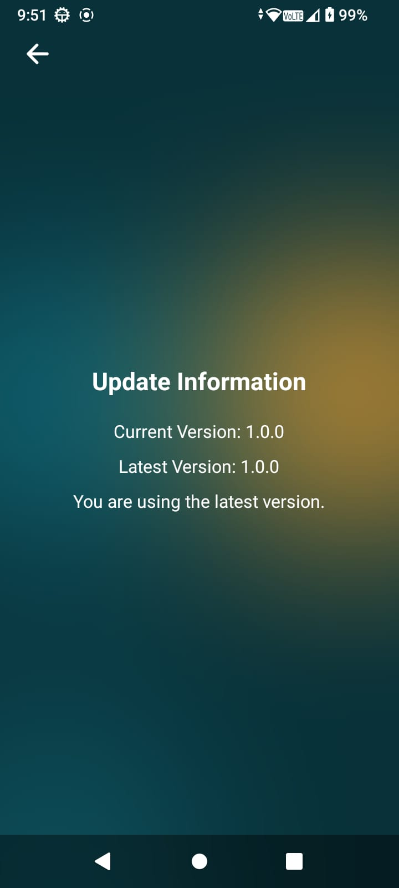

# 🌦️ CaliWeather - A React Native Weather App

CaliWeather is a sleek, modern, and intuitive weather forecast application built with React Native and Expo. It provides real-time weather data, a 7-day forecast, and a dynamic, location-aware user experience. The app features a beautiful, blurred-glassmorphism interface that changes to reflect the current weather conditions.

### App Demo

---

## ✨ Features

-   **Dynamic UI**: A beautiful, immersive user interface with a blurred background that provides a modern, clean look.
-   **Current Weather**: Get instant access to the current temperature, weather conditions (e.g., "Partly Cloudy"), wind speed, humidity, and sunrise/sunset times.
-   **7-Day Forecast**: Plan your week ahead with a detailed 7-day forecast, including daily average temperatures, weather conditions, and dates.
-   **Location-Based Weather**:
    -   **Auto-Detection**: Automatically fetches weather data for your current physical location using the device's GPS.
    -   **City Search**: A powerful search functionality to find and view weather for any city in the world.
-   **Persistent State**: Your last searched location is saved locally, so the app always opens with relevant data for a seamless user experience.
-   **Over-the-Air Updates**: Seamlessly receive updates and new features without needing to reinstall the app from the app store.
-   **Loading & Empty States**: Smooth loading indicators and helpful messages guide the user during data fetching or when no location is selected.

---

## 📸 Screenshots

| Home Screen                                | Details Screen 1                               | Details Screen 2                             | Update Screen                                  |
| :----------------------------------------- | :------------------------------------------- | :------------------------------------------ | :----------------------------------------- |
|        |       |     |          |

---

## 🛠️ Tech Stack & Tools

-   **Framework**: React Native with Expo
-   **Weather Data API**: OpenWeatherMap API
-   **Build & Updates**: Expo Application Services (EAS) for builds and OTA updates.
-   **Update Manifest Hosting**: GitHub Gist for hosting the OTA update manifest.
-   **Navigation**: Expo Router for file-based, native navigation.
-   **Styling**: NativeWind (Tailwind CSS for React Native).
-   **State Management**: React Hooks (`useState`, `useEffect`, `useContext`).
-   **API Client**: Axios for making requests to the weather API.
-   **Icons**: Heroicons for crisp, modern iconography.
-   **Local Storage**: AsyncStorage for persisting the user's last-viewed city.
-   **Utilities**: Lodash (for debouncing search input).

---

## OTA Update Mechanism

CaliWeather uses **Expo's EAS Update** service to deliver **Over-the-Air (OTA)** updates, allowing you to receive new features and bug fixes instantly — without reinstalling the app from the app store.

- The **update manifest** (containing the latest version info) is hosted on a public **GitHub Gist**.
- On app launch, CaliWeather checks this manifest and downloads updates in the background if a new version is available.
- For full releases, the latest **.apk file** is published on the app’s **GitHub Releases** page.
- Builds are created using **React Native with Expo EAS** to ensure smooth deployment and consistent performance across devices.
